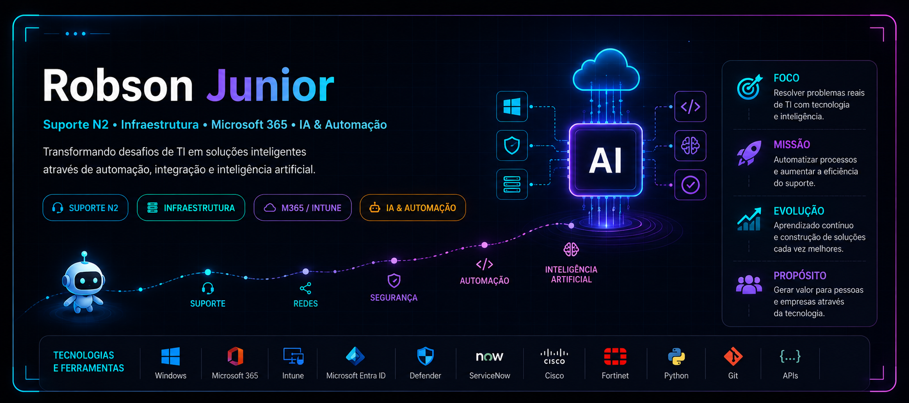

<div align="center">

<!-- Banner (Lembre-se de fazer o upload de banner.jpg no seu repositório) -->

<br><br>


<br>

<!-- Badges Estilizadas de Status -->


</div>

<hr>

## 👨‍💻 Sobre mim

<table>
  <tr>
    <td width="60%" valign="top">
      Sou <b>Robson Junior</b>, profissional de Tecnologia da Informação com mais de <b>8 anos de experiência</b>, com foco em <b>Suporte Técnico N2, infraestrutura e ambientes corporativos de grande porte</b>.<br><br>
      Gosto de transformar desafios diários em soluções práticas. Minha experiência sólida em <b>troubleshooting, Windows, Microsoft 365, Azure/Entra ID e redes</b> agora se une ao meu objetivo de crescer no desenvolvimento de software.<br><br>
      Atualmente, estou expandindo minha atuação para construir uma base sólida em <b>Python, integração com APIs, Inteligência Artificial e automação</b>.<br><br>
      <ul>
        <li>☁️ <b>Evoluindo forte em Cloud Computing</b> (Microsoft 365 / Azure)</li>
        <li>💻 <b>Construção de aplicações e ferramentas úteis</b> de suporte</li>
        <li>🤖 <b>Interesse profundo em IA</b>, agentes e produtividade</li>
        <li>⚙️ <b>Criação de soluções</b> para reduzir tarefas repetitivas</li>
      </ul>
    </td>
    <td width="40%" valign="top" align="center">
      <div align="center">
        <b>ROBSON // TECH PANEL</b><br>
        <sub>Support • Cloud • AI • Automation</sub><br><br>
        <br>
        <br><br>
        <br>
        
      </div>
    </td>
  </tr>
</table>

<hr>

## 🧰 Stack Tecnológica

<div align="center">

  

  <br><br>

  
  
  
  
  

</div>

<hr>

## 🏆 Formação & Credenciais

<div align="center">

| ☁️ Microsoft & Cloud | 🎓 Sistemas e Redes | 🤖 IA & Automação |
| :---: | :---: | :---: |
| **Microsoft 365 / Entra ID** | **Análise e Desenv. de Sistemas** | **Trilha de IA e Scripts** |
| Vivência Corporativa N2 | Graduação na Anhanguera | Estudos contínuos |
| `Intune` • `Defender` • `Azure` | `Software` • `Segurança` • `DNS` | `Python` • `APIs` • `OpenAI` |

</div>

<hr>

## 🚀 Projetos em destaque

<br>

### 🌟 Featured Projects
*(Projetos e iniciativas voltadas ao suporte e engenharia)*

<table>
  <tr>
    <td width="50%">
      <b>🤖 AI Service Desk Assistant</b><br>
      <sub>Inteligência Artificial / Suporte Técnico</sub>
      <ul>
        <li>Transformação de conhecimento de troubleshooting em IA.</li>
        <li>Análise de incidentes e sugestão de causas.</li>
        <li>Integração com APIs e automação de chamados.</li>
      </ul>
      <a href="https://github.com/RobsonLost/assistente-ia-service-desk"></a>
    </td>
    <td width="50%">
      <b>🛠️ Automação de Processos N2</b><br>
      <sub>Python / Scripts / Produtividade</sub>
      <ul>
        <li>Scripts para eficiência em ambiente Windows.</li>
        <li>Integração de serviços e gestão via REST APIs.</li>
        <li>Soluções ágeis para demandas repetitivas.</li>
      </ul>
      <a href="https://github.com/RobsonLost"></a>
    </td>
  </tr>
</table>

<hr>

## 📊 GitHub Analytics

<div align="center">
  <!-- Gráfico de Contribuições (Activity Graph) - Este estava funcionando, então mantivemos -->
  
</div>

<br>

<div align="center">
  <!-- Status do Github substituídos por uma API mais estável -->
  
  
</div>

<hr>

## 🛰️ Tech Mission

```text
☁️ CLOUD MISSION → aprofundar Microsoft 365, Azure e tecnologias de infraestrutura
💻 SOFTWARE MISSION → evoluir em Python e criar aplicações úteis para problemas reais
🤖 AI MISSION → explorar Inteligência Artificial aplicada ao suporte e operações de TI
⚙️ AUTOMATION MISSION → automatizar tarefas repetitivas e escalar produtividade
🔌 API MISSION → integrar sistemas, ITSM (ServiceNow) e modelos de IA através de APIs
📈 CAREER BUILDING → transformar experiência prática + estudos num portfólio de peso

```

## 🤝 Vamos conectar

<div align="center">
  
  <a href="https://www.linkedin.com/in/robsongjunior">
    
  </a>
  <a href="mailto:robson.lost@outlook.com">
    
  </a>
  <a href="https://github.com/RobsonLost">
    
  </a>

</div>
